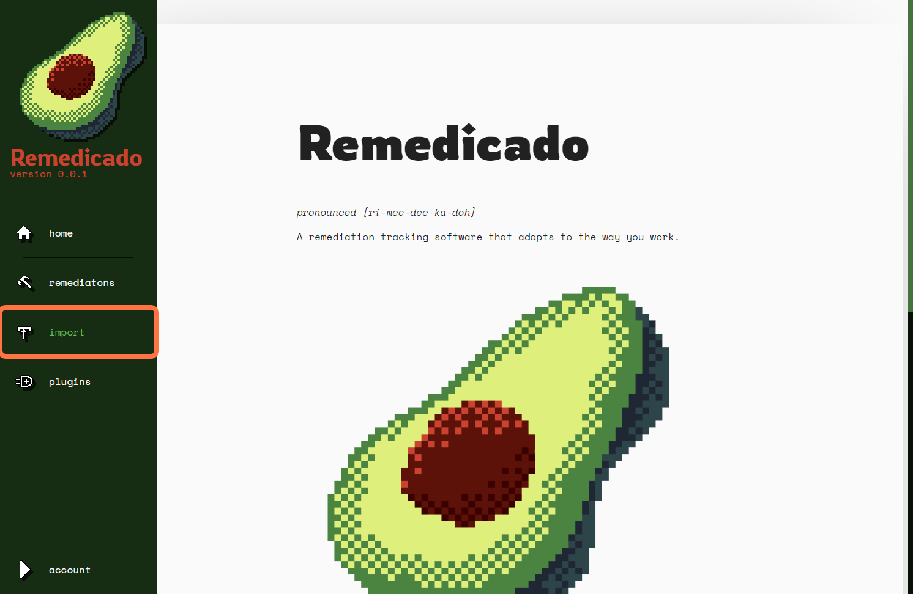
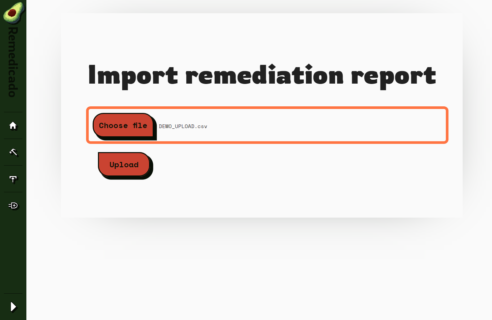
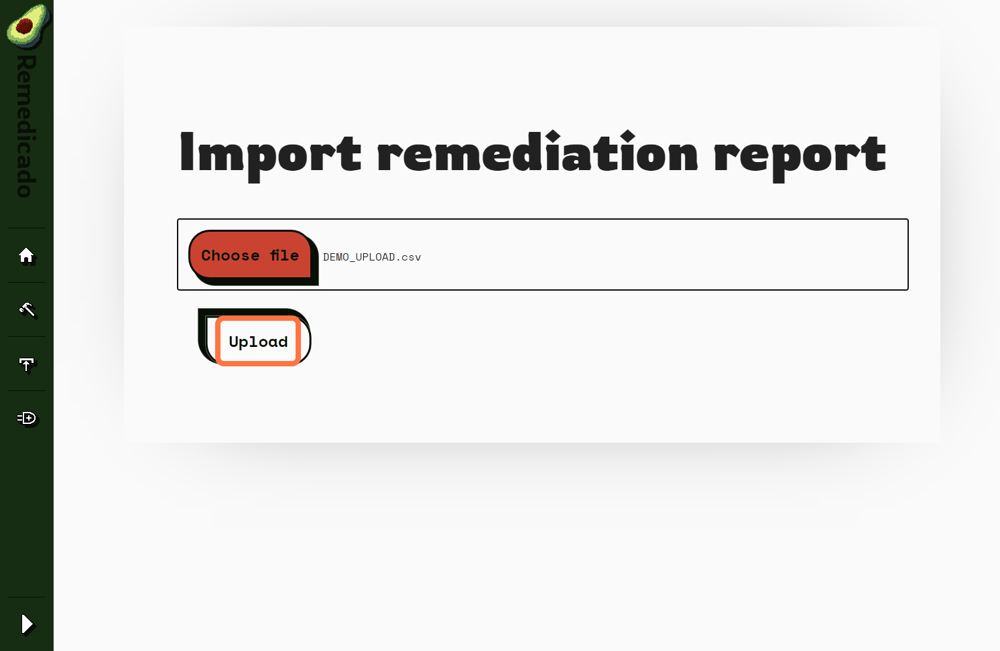
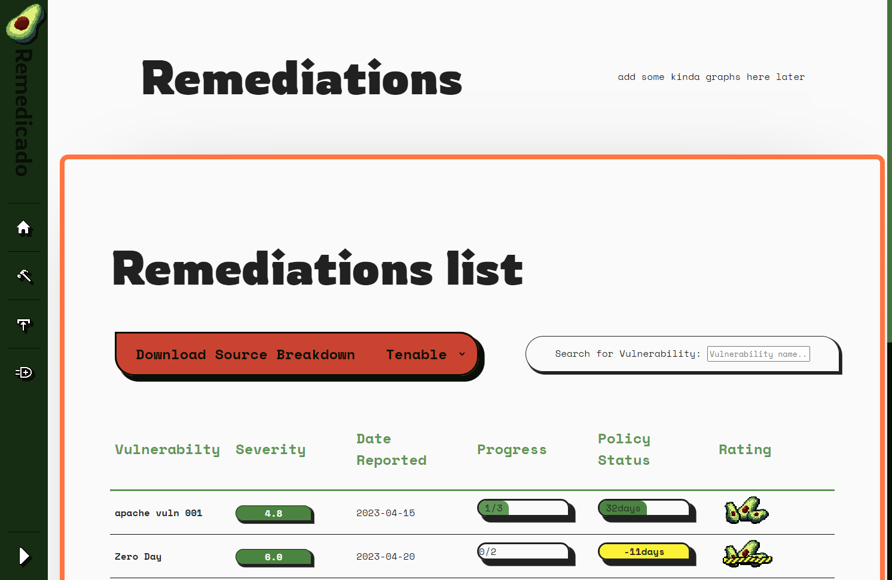

# Steps to: Import remediations

__Creation Date:__ May 22, 2023  
__Created By:__ @Sam-Clutterbuck    

### [Back to contents](webGUI_contents.md)

***

## How to import remediations

### 1. Click on import

### 2. Click on Choose file and select the file to upload

### 3. Click on Upload

### 4. Once uploaded you will be taken to the Remediations list page

***