# Steps to : Manage  Users and Sources

__Creation Date:__ May 22, 2023  
__Created By:__ @Sam-Clutterbuck    

### [Back to contents](webGUI_contents.md)

***

## How to access User and Source Settings

### 1. Hover over account

### 2. Click on settings

## How to add a new source

### 3. Click Add Source
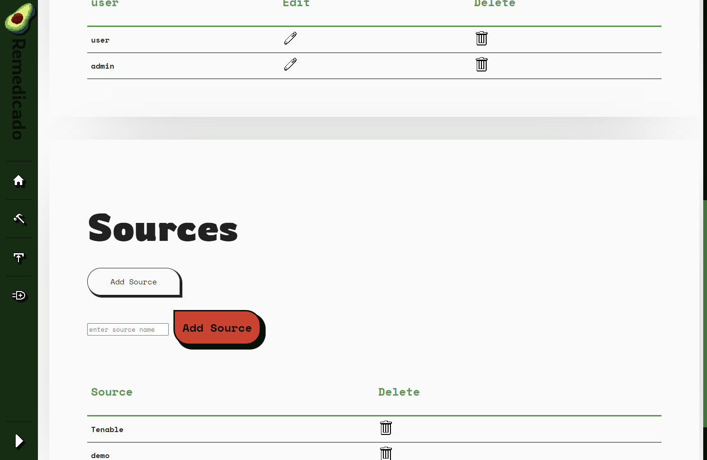

### 4. Enter the name of your new source
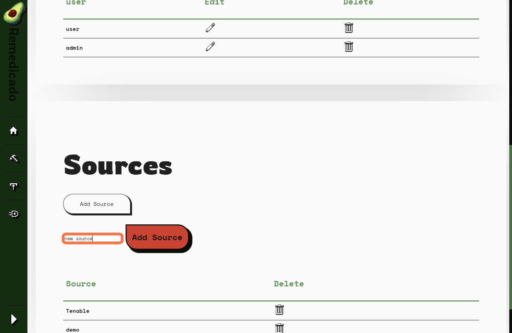

### 5. Click on Add Source
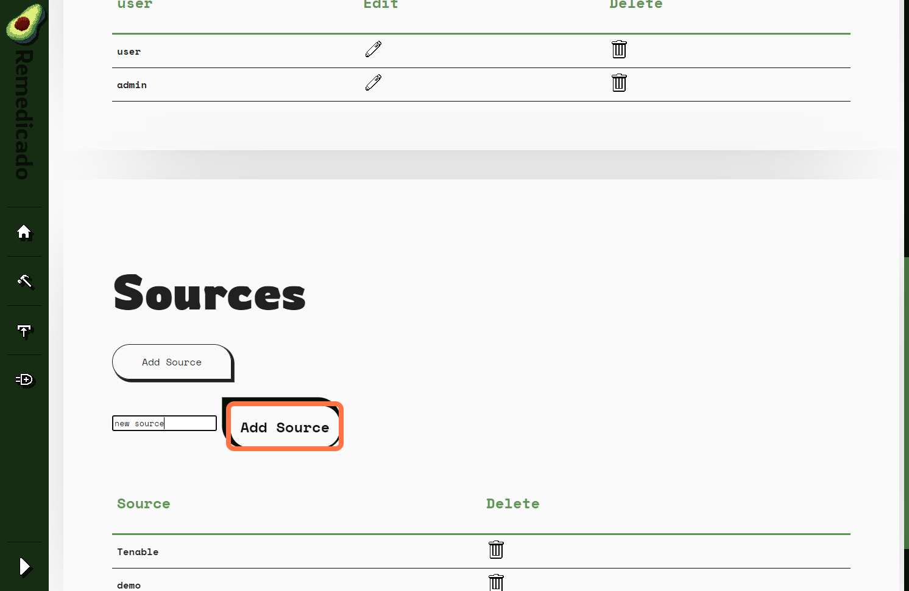

## How to delete a source

### 6. Click on the delete icon
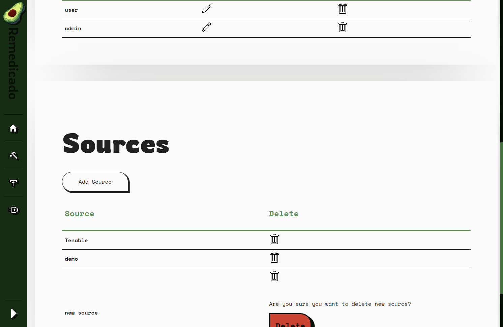

### 7. Click on Delete
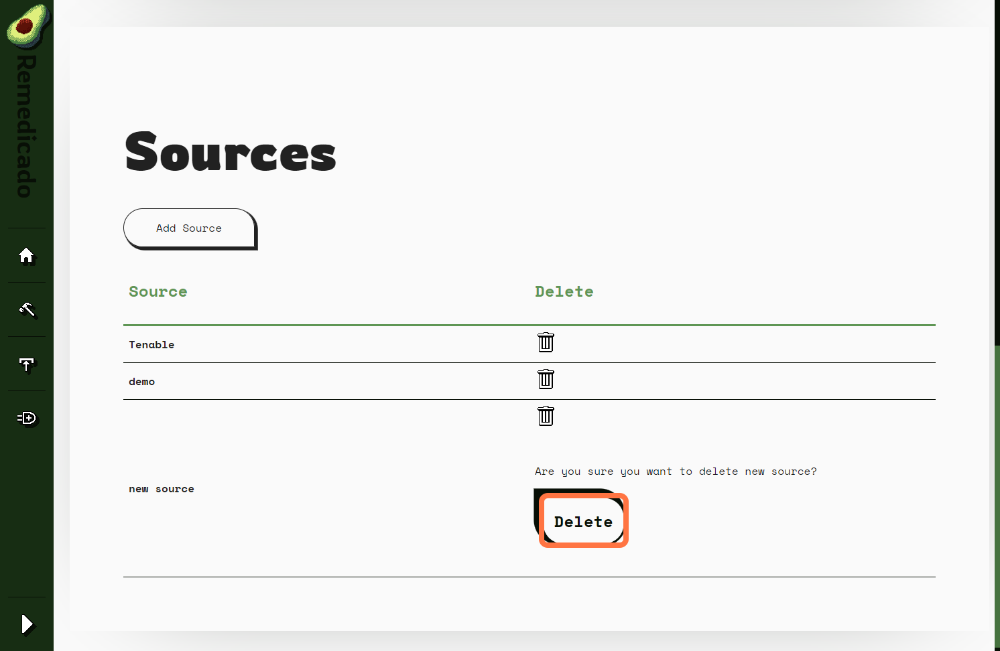

## How to add a user

### 8. Click on Add User
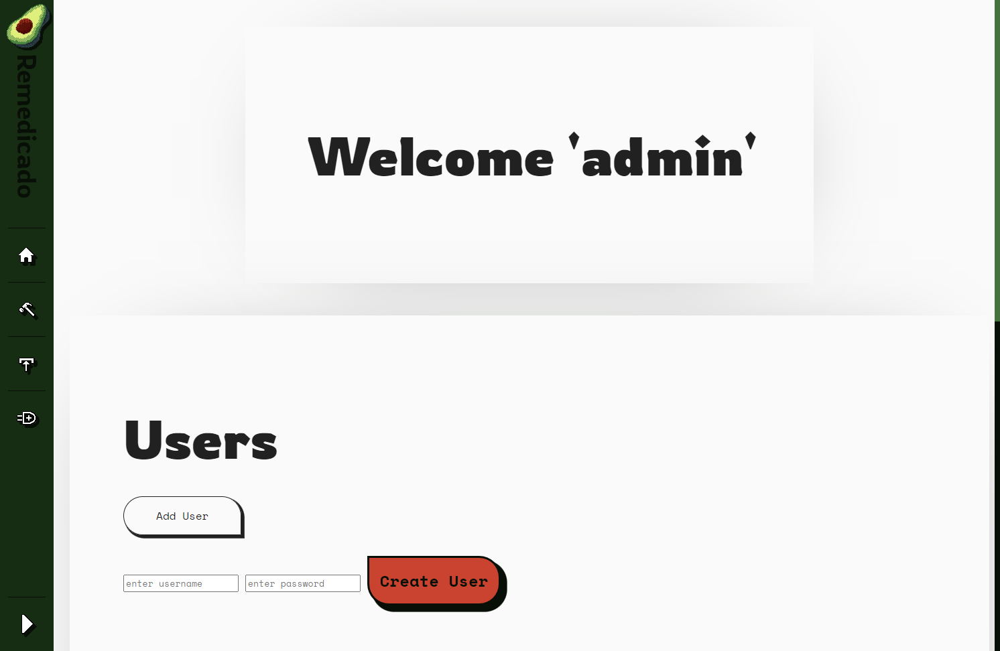

### 9. Enter the new username and password then click on Create User
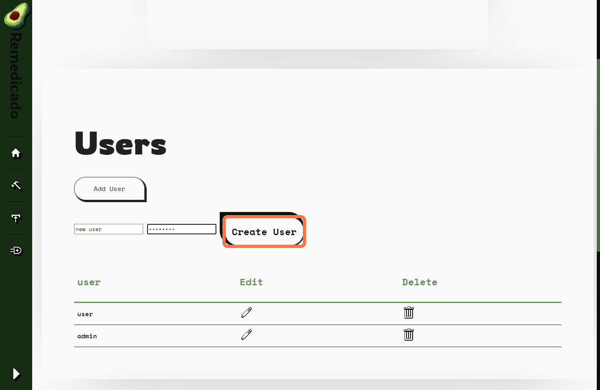

## How to reset a users password

### 10. Click on edit icon
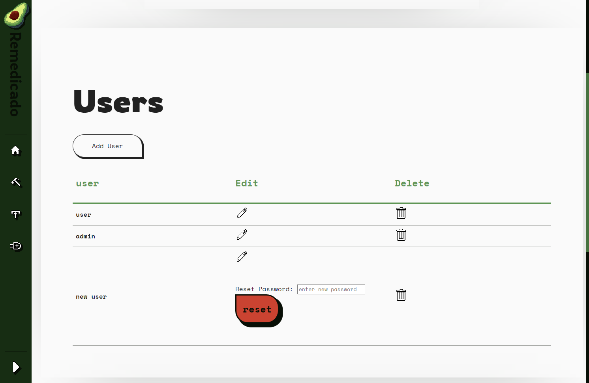

### 11. Type new password
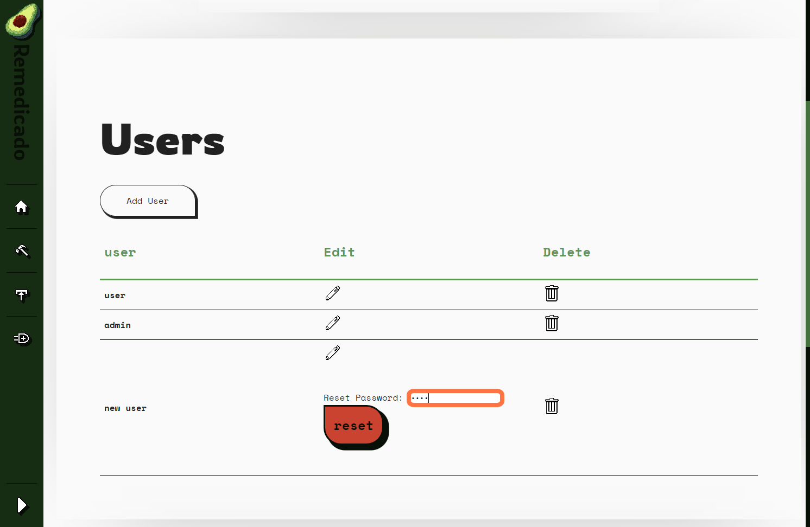

### 12. Click on reset
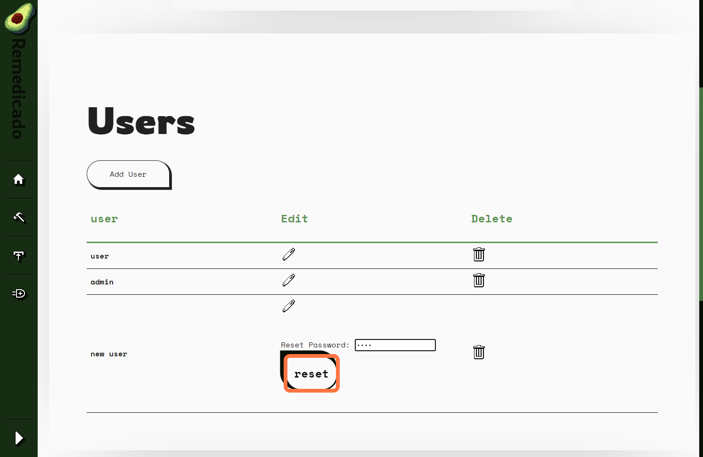

## How to delete a user

### 13. Click on delete Icon
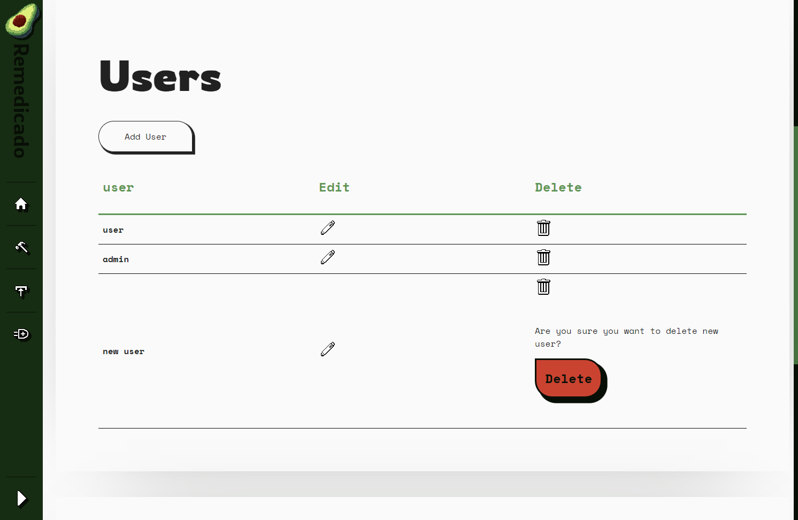

### 14. Click on Delete
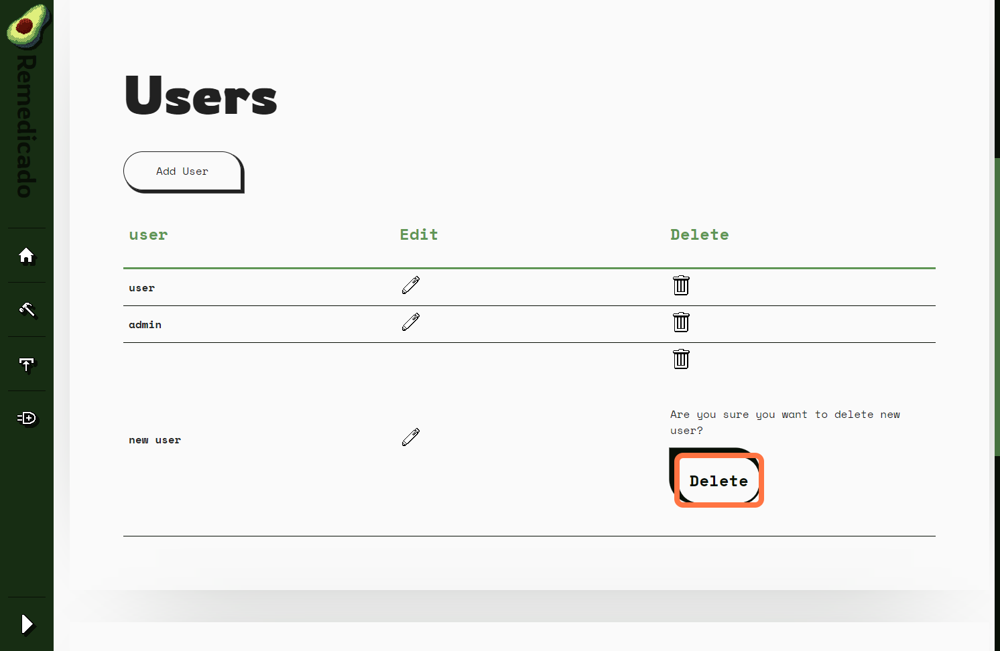

***