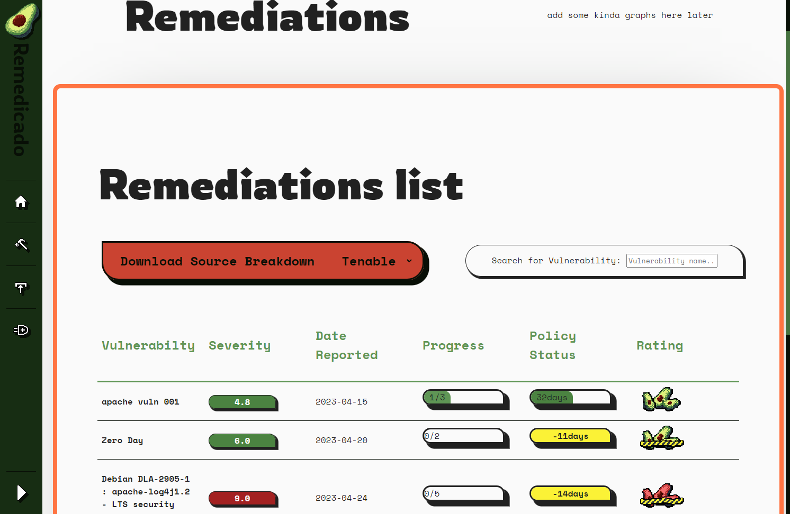
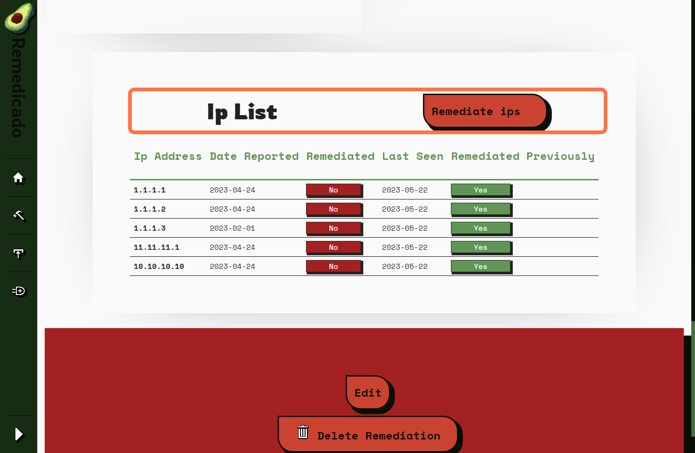

# Steps to: View and edit a Security Vulnerability 

__Creation Date:__ May 22, 2023  
__Created By:__ @Sam-Clutterbuck    

### [Back to contents](webGUI_contents.md)

***

## How to view remediation details

### 1. Click on Remediations list…

### 2. Click on the vulnerability you want to expand

### 3. This will display info about the vulnerability

### 4. Below is the vulnerability description

### 5. Next to this you can find any additional reports

## Add vulnerability Reports

### 6. Click on Choose file and select a report to upload

### 7. Click on Upload Vulnerability Report to save the report to Remedicado

## Remediate Ip's

### 8. At the bottom you will find the affected Ip's list

### 9. Click Remediate ips

### 10. Enter the Ip's that you want to set to remediated and click on Remediate

### 11. The Ip List will be updated to show remediated Ip's

### 12. The Severity Remediation progress will change to reflect Ip changes

## Edit remediation

### 13. Click on Edit

### 14. Edit whatever fields need editing

### 15. Click on Reset to reset changes or click on Submit to commit changes

## Delete remediation

### 16. Click on Delete Remediation

### 17. If you are sure you want to delete the remediation click on delete 

***