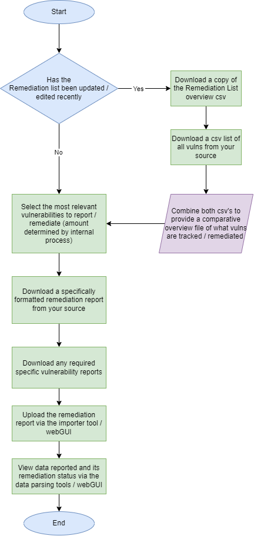

# Process Workflow
The process to use Remedicado is simple and easy to follow. 



There are 3 main steps of the workflow:
### Pre-Import
There are a few prerequisites to ease the process of importing . The first thing is to download a copy of the Remediation List overview csv from Remedicado. This overview contains a list of all documented remediations for the chosen source containing the following details:
```
Source_ID
Number of reported IPs
Number of affected IPs (exluding remediated IPs)
Last reported date
```
It is recommended to then go to your source of choice and download a csv containing:
```
Source_ID (e.g. plugin ID)
Vulnerability Name
Severity
Number of affected IPs
```
Once you have both of these csv's you can then combine them, linking the reported source Id's to the ones from your source to provide a quick overview of what remediations you have already reported and if there are any new ips found, etc... Using this overview you can select what vulnerabilities to report for remediation based on your own internal process, be that reporting all of them or just the top 10 from your evaluation. You could also include any sources that have increased ip counts.
***!!! We are planning to add helper tools for this !!!***

Once you have determined the vulnerabilities to report then you need to create a csv report containing the following information for all of the selected vulnerabilities. ***(Note: The layout of the report should be in the following order)***
```
"source","source_id","name","desc","severity","ips"

	- source - This should be set to the name of the source you are using 
			- e.g. Nessus
	- source_id - This should be the source id you chose to use 
			- e.g. Plugin IDs
	- name - This is the summary / name of the vuln
	- desc - This can include any information about the vuln you want to know
			- e.g. The provided description and / or the solution 
	- severity - This is the cvss v3 Score
	- ips - This is a list of the ip addresses for every affected ip seperated by commas
```

e.g. csv
```
"source","source_id","name","desc","severity","ips"
"Tenable","123456","apache vuln","an apache vuln","7.5","10.10.10.10, 10.10.10.30"
```


###  Importing
Once you have your csv report containing the required information. You can use the importer tools or webGUI to simply upload a file and have the Remedicado system convert it into the correct format and store the data.

